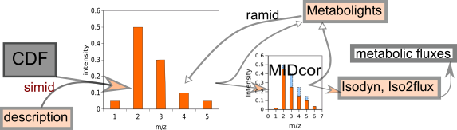

# simid 
Version: 1.0

## Short description
R-program to read CDF files, created by mass spectrometry machine, and evaluate the mass spectra of 13C-labeled metabolites 

## Description

SIMID is a computer program, written in R, designed to read netCDF files generated by mass spectrometer in SIM (selected ion monitoring) mode, containing time courses of m/z spectra registered for various metabolites. It evaluates the peaks of mass isotopomer distribution (MID) of metabolites, thus preparing the data to further correction for natural isotope occurrence. The github repository "https://github.com/seliv55/simid" is used to create the docker image. 

SIMID reads the CDF files presented in the working directory, finds the spectra corresponding to specific metabolites of interest; corrects baseline for each peak in the spectra; choses the time points where the distribution of peaks is less contaminated by other compounds and thus is the most representative of the real distribution of mass isotopomers in the analyzed metabolite; evaluates this distribution, and saves it in files readable by MIDcor, a program, which performs the next step of fluxomic analysis, i.e. correction of the SIMID spectra for natural isotope occurrence.
The functions performed by SIMID are similar to those of RaMID (https://github.com/seliv55/ramid). However, there is a difference in the input data for both programs. Ramid uses the description of metabolites of interest provided in the format of the table, exchangeable with the database Metabolights. Therefore it designed for primary analysis of mass spectra already presented in this database and downloaded from it. Alternatively, SIMID is created for the initial step of analysis of recently obtained data that are not uploaded to Metabolights yet. The output SIMID provides in the format of the table, exchangeable with Metabolights, and also in a human-readable form.
The difference in the format of input data description also determines an essential difference in the code. Input tables for RaMID provide the direct references to the CDF files corresponding to the information written in each line of the table. The input information for SIMID does not contain such a reference. The absence of reference simplifies the data description for the user but makes the code more complicated: it searches the desired spectra one by one through all the provided CDF files.

## Key features

- Primary processing of 13C mass isotopomer data obtained with GCMS: evaluation of mass spectra for the metabolites of interest.

## Functionality

- Preprocessing of raw data
- initiation of workflows

## Approaches

- Isotopic Labeling Analysis / 13C
    
## Instrument Data Types

- MS
- GC-MS

## Screenshots

- screenshot of input data (format Metabolights), output is the same format with one more column added: corrected mass spectrum


## Tool Authors

- [Vitaly Selivanov](https://github.com/seliv55) (Universitat de Barcelona)

## Container Contributors

- [Vitaly Selivanov](https://github.com/seliv55) (Universitat de Barcelona)
- [Pablo Moreno](https://github.com/pcm32) 

## Website

- https://github.com/seliv55/simid

## Git Repository

- https://github.com/seliv55/simid

## Installation

simid is present on all PhenoMeNal Galaxy instances on deployed Cloud Research Environments, under the Fluxomics category in the tool bar to the left of the screen. No installation is needed hence on PhenoMeNal Cloud Research Environments.

For advanced Docker usage:

- Go to the directory where the dockerfile is (https://github.com/seliv55/container-simid).
- Create container from dockerfile:

```
docker build -t simid .
```

Alternatively, pull from repo:

```
docker pull container-registry.phenomenal-h2020.eu/phnmnl/simid
```

## Usage Instructions

On a PhenoMeNal Cloud Research Environment, go to Fluxomics tool category, and then click on simid, and fill the expected input files, then press Run. Additionally, the tool can be used as part of a workflow with Midcor, Iso2flux and the Escher-Fluxomics tools. On a PhenoMeNal deployed CRE you should find as well a Fluxomics Stationary workflow, which includes simid. 

- To run simid as a docker image created in the PhenoMeNal repository, execute
 
```
docker run -it -v $PWD:/data container-registry.phenomenal-h2020.eu/phnmnl/simid -i /data/input -o /data/output_dir -z /data/CDF_dir
```
- To run simid as a docker image created locally:

```
docker run -it -v $PWD:/data simid -i /data/input -o /data/output_dir -z /data/CDF_dir
```
- example
```
docker run -it -v $PWD:/data simid -i /data/sw620 -z /data/SW620/ -o /data/files/
```
The working directory could be any directory in the used computer, it is named for the docker image as "/data". It should contain: i) an input data description (in the presented example in the file "sw620"), and ii) a directory containing CDF file (here "/files/"). The output is provided as CSV table in the format exchangeable with Metabolights, here it is named "files/all_info". Whereas the output file is generated automatically and do not require any specific explanation, the first and the last parameters, the format of input data description (here "metdata") and the convention for CDF file names do require explanations, although thes formats made maximally simple for the data provider. They are described below.

- run test1 using the test data (available for reference in [this Google Drive folder](https://drive.google.com/drive/folders/17dBkItF19KjT4b_3-9j6yGMJVcQIWonJ)).
 
```
docker run -it --entrypoint=simidTest1.sh simid
```
## The format of input data description

- The input data description file (here "sw620") contains the additional information prepared by the data provider that is necessary for the analysis and for the output table to write in the format accepted as exchangeable with the Metabolights database. It contains the following columns:
(i) names of metabolites of interest, which spectra should be extracted from the provided CDF files;
(ii) retention time (RT);
(iii) m/z value of the lightest isotopomer (mz0) corresponding to the resolved derivatized fragment of metabolite of interest;
(iv) position of the resolved carbon fragment in the parent molecule;
(v) chemical formula of the derivatized compound containing the given fragment;
(vi)  m/z value of the lightest isotopomer corresponding to another fragment of the same metabolite (control).

## The names of CDF files provided

- The input file (here "sw620") provides the general informarion used by the program. Moreover, the names of CDF files should contain a specific information referred to each separate measurement. Here is an example of filename: "SW620_6h_12Glc_R1_PIM_SIM_01.CDF".
SW620 is the type of analyzed cells
6h is the time of incubation
12Glc indicates the artificially labeled substrate applied.
R1 is a number of biological replicate
01 is a number of ingection to MS machine from the same biological replicate

Based on this information and that extracted from the CDF files presented in the working directory siMID evaluates the mass spectra of the metabolites listed in "metdata", and saves it in tables accepted as exchangeable with Metabolights database.

 
## Publications

- 
